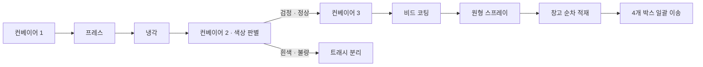

# ABB 로봇 기반 타이어 공정 자동화

대한상공회의소 천안기술교육센터 자동화 설비 교육과정에서 진행한 팀 프로젝트입니다. ABB 로봇과 PLC I/O 신호를 연계해 **이송 → 프레스 → 냉각 → 색상 판별 → 코팅 → 창고 적재** 공정을 구성했습니다.

**[시연 영상 보기](https://www.youtube.com/watch?v=O2JILGMgIAs)** · **[메인 RAPID 코드](project.mod)** · **[Python 통신 코드](pc_client/)**

## 담당 역할

김영준: 공정 기획과 팀 회의 진행, ABB RAPID 코드 작성, 실제 로봇의 좌표·동작 티칭, Python TCP 통신 프로그램 구현을 담당했습니다. 팀 프로젝트의 설비 전체를 혼자 제작한 것이 아니며, PLC 래더 개발 전체를 담당했다는 의미도 아닙니다.

## 공정 흐름

도식은 공정의 구성과 의도된 흐름입니다. 현재 코드에는 반복 불량 처리 등 [제한사항](docs/limitations.md)이 남아 있습니다.

## 구현 내용

- **로봇 동작:** 설비 위치에 맞춘 좌표 티칭과 RAPID 공정 시퀀스 작성.
- **I/O 연계:** `di21`~`di26` 계열 신호에 따른 단계별 동작, 색상 신호에 따른 정상·불량 분기.
- **냉각·코팅:** 냉각 자세 변경 동작, 비드 코팅, `MoveC`를 이용한 원형 스프레이 동작.
- **적재 관리:** `Count`로 4개 박스의 적재 위치를 선택하고 일괄 이송 후 초기화.
- **PC 통신:** RAPID TCP 서버와 Python 클라이언트의 텍스트 명령 통신. Python 도구에는 JSON·MC Protocol 기능도 포함되지만 타이어 공정 명령은 Plain Text 모드입니다.

## 파일 안내

| 경로 | 내용 |
|---|---|
| [project.mod](project.mod) | 메인 RAPID 모듈. 좌표, 공정 시퀀스, TCP 서버, 인터럽트 처리 |
| [DI_DO_Signals.csv](DI_DO_Signals.csv) | 원본 DI/DO 신호표. 줄번호·메모 포함 |
| [pc_client/](pc_client/) | Python 통신 도구와 사용 방법 |
| [docs/process-flow.md](docs/process-flow.md) | 공정별 신호와 동작 설명 |
| [docs/communication.md](docs/communication.md) | 연결 구조와 명령 처리 방식 |
| [docs/limitations.md](docs/limitations.md) | 현재 코드의 제한사항과 검증 범위 |
| [docs/source-map.md](docs/source-map.md) | 원본 위치, 복사 범위 및 제외 자료 |

이 폴더는 기존 [RobotStudio](../RobotStudio/)에서 프로젝트 핵심 파일을 복사해 설명을 정리한 별도 버전입니다. 기존 파일과 링크는 그대로 유지했으며, 복사한 코드의 동작은 변경하지 않았습니다. 두 위치는 자동으로 동기화되지 않습니다.
