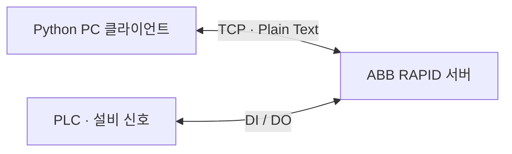

# PC·로봇 통신 구조

RAPID `Main`의 바인딩 값은 `192.168.3.3:5000`입니다. 이는 원본 실습 환경의 값이며 현재 접속 가능한 장비 주소라는 의미가 아닙니다.

| 명령·상태 | 실제 코드에서의 처리 |
|---|---|
| `start` | `Main`에서 수신하면 생산 루틴 호출 |
| `end` | `Main`에서는 연결 반복 종료. 연속 생산 중에는 사이클 사이의 `Check_For_End_Command`에서 확인 |
| `Message acknowledged` | `Main`의 수신 루프가 전송하는 응답. 모든 경로의 공통 응답은 아님 |
| `Count > 0` | 접속 시 새 `start` 없이 연속 생산 루틴에 진입하는 경로가 있음 |
| `EMERGENCY STOP` | 연결 상태에 따라 트랩에서 송신하는 메시지 |

`end`는 즉시 안전 정지 명령이 아닙니다. 생산 루틴 내부 모든 동작에서 수신을 감시하지 않으며, 사이클 사이에 검사합니다.

Python `main.py`는 타이어 전용 UI가 아닌 범용 콘솔 통신 도구입니다. Plain Text, JSON, MC Protocol을 선택할 수 있습니다. 타이어 RAPID 서버는 문자열을 정확히 비교하므로 Plain Text에서 소문자 `start`·`end`를 사용합니다. JSON 모드나 실습용 `11/22/33/qq` 명령을 이 공정의 명령으로 혼동하지 않아야 합니다.

여러 연결을 설정할 수 있지만 `run_connections`는 순서대로 세션을 진행합니다. 병렬 중앙 관제 서버라고 설명하지 않습니다. JSON·MC Protocol 기능의 존재만으로 이 프로젝트에서 해당 프로토콜 전체를 사용했다고 단정하지 않습니다.

[Python 사용 안내](../pc_client/README.md) · [현재 제한사항](limitations.md)
